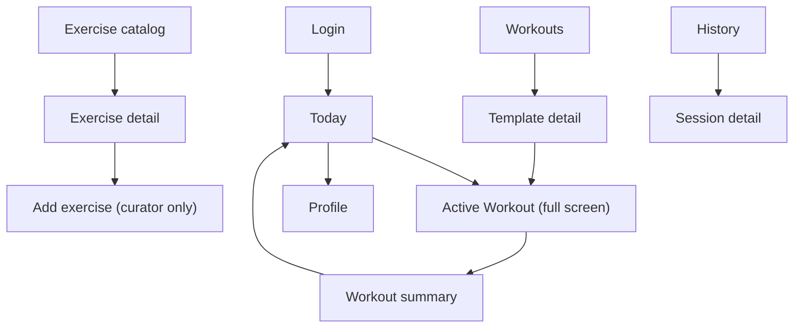

# GymTrack Pro — Design Spec (UI / UX)

> **How to use this file:** the agreed design system and screen architecture, written before any component exists.  
> Change a decision here **before** changing components, so the UI stays coherent.

**Last updated:** August 2026  
**Product:** GymTrack Pro  
**Related:** [FEATURES.md](./FEATURES.md) · [TECH_STACK.md](./TECH_STACK.md) · [DOMAIN_SPEC.md](./DOMAIN_SPEC.md)

---

## 1. Design context

This is not a general fitness app used on a couch. It is used **standing in a gym, on a phone, one-handed, mid-workout**, by someone breathing hard with sweaty fingers, who needs to read a number at arm's length and get back to the bar.

Every decision below answers to that. Where "looks nice" and "readable while out of breath" conflict, readability wins.

**Two audiences** (FEATURES section 2):

| Persona | Design consequence |
|---------|--------------------|
| Brunno (advanced) | Density and speed: intensity techniques, per-set unit control, fast set entry |
| Family (simpler) | Nothing advanced is *required*; defaults work without touching options |

The resolution is **progressive disclosure**, and there is deliberately **no separate simplified mode** (decision 9.6): the simple path is the default path, and advanced controls stay one deliberate tap away rather than crowding the screen. Every user runs the same interface.

---

## 2. Aesthetic direction

**Chosen direction: industrial instrument panel.**

The visual reference is gym hardware itself — plate markings, rack numbering, the readout on a cable machine — not a SaaS dashboard. Dark, high-contrast, unapologetically utilitarian, with numbers treated as the hero content and everything else receding.

**The one memorable thing:** the active workout screen reads like a piece of equipment. Oversized tabular numerals, a stepper that feels physical, and a rest timer that takes over the whole screen as a single giant arc you can read across a room.

**Deliberately rejected:** the default startup look — white background, soft rounded cards, a purple or blue gradient, thin grey text. It is pleasant on a desk and useless under gym lighting at arm's length.

### 2.1 Colour

Dark is the default theme, not an option bolted on. Gyms are dimly lit more often than not, and a white screen at 6 a.m. is hostile.

| Token | Value | Role |
|-------|-------|------|
| `--surface-0` | `#0B0C0B` | App background — near-black, slightly warm, never pure `#000` (harsh, and smears on OLED scroll) |
| `--surface-1` | `#151714` | Cards, sheets |
| `--surface-2` | `#22251F` | Raised controls, stepper bodies |
| `--line` | `#33372E` | Hairlines, dividers |
| `--text-primary` | `#F2F4EC` | Body text |
| `--text-muted` | `#9AA08E` | Labels, secondary |
| `--volt` | `#D7FF3E` | **Single primary accent** — active set, primary action, progress |
| `--amber` | `#FFB627` | Timers, "in progress", caution |
| `--ember` | `#FF5436` | Failure, destructive, dead media link |

One dominant accent with sharp signal colours beats an evenly spread palette. Volt on near-black is roughly a 15:1 contrast ratio — readable across the gym floor. Text placed **on** volt or amber is always `--surface-0`, never white.

**Light theme ("chalk")** exists for daylight and accessibility preference: warm off-white `#F4F3EC` base, near-black text, same volt used as a *fill* with dark text on top — never as text colour, where it fails contrast on light backgrounds.

Theme follows the system preference by default, with a manual override in Profile.

### 2.2 Typography

Two families, loaded via `next/font`:

| Use | Family | Why |
|-----|--------|-----|
| Display, numerals, labels | **Archivo** (variable, wide/expanded axis used for headings) | Industrial, poster-like character; wide forms read well at a glance |
| Body, long text | **Instrument Sans** | Clean and legible without the anonymity of Inter or Roboto |

Explicitly avoided: Inter, Roboto, Arial, system-ui defaults, and Space Grotesk. They are the visual signature of a generated interface.

**Numerals are tabular.** Every weight, rep count, and timer uses `font-variant-numeric: tabular-nums`. This is not decoration: with steppers, the number changes on every tap, and proportional digits make the layout jitter as widths change. Fixed-width digits hold still. If Archivo turns out to lack real tabular figures, the numeric readouts switch to a monospace face rather than dropping the requirement.

**Scale** (mobile first):

| Element | Size | Notes |
|---------|------|-------|
| Set numerals (weight, reps) | 44px | Readable at arm's length with the phone on the floor |
| Timer readout | 72px | Glanceable across the room |
| Screen title | 24px | Archivo, expanded |
| Body | 16px | Never below 16px — smaller triggers iOS zoom-on-focus |
| Label / eyebrow | 12px, uppercase, `letter-spacing: 0.08em` | The industrial cue; used sparingly |

### 2.3 Space, shape, texture

4px base unit; use 8 / 12 / 16 / 24 / 32 / 48.

Corners are tight — 4px on controls, 8px on cards. Soft 24px pill shapes read consumer-friendly and fight the instrument metaphor.

Atmosphere comes from a faint grain overlay on `--surface-0` (about 3% opacity noise) and from **hazard-stripe accents**: 45-degree volt-on-dark stripes used as a thin marker on the active exercise and on the drop-set stage indent. Used once or twice per screen; they are punctuation, not wallpaper.

No drop shadows on dark surfaces — elevation is expressed by the surface ladder above and by hairlines.

### 2.4 Motion

Restrained and functional, `Motion` for React where it earns its place:

- Stepper press: 80ms scale-down plus a volt flash on the digit. Confirms the tap without waiting for network.
- Set completed: the row collapses to a compact summary in 200ms, and the next set becomes active.
- Rest timer: the arc sweeps continuously; the last 3 seconds pulse the numeral.
- Screen transitions: 150ms fade and 8px rise. No slide carousels.

All motion respects `prefers-reduced-motion`, which disables transforms and keeps opacity changes only.

---

## 3. Screen inventory and navigation

**Decision: hybrid navigation.** Four bottom tabs for browsing; the active workout takes the full screen with the tab bar removed.

The reasoning is behavioural: during a set you do not navigate, you log. Removing the tab bar eliminates a whole class of accidental taps with a wet thumb and returns roughly 64px of vertical space to the controls that matter.



### 3.1 Tabs

| Tab | Purpose |
|-----|---------|
| **Today** | Resume an unfinished session, start from a template, or start empty. The landing screen answers "what am I doing right now?" |
| **Workouts** | Templates: list, create, edit, favourite, archive |
| **Exercises** | Catalog: search in Portuguese or English, filter by emphasis and equipment |
| **History** | Past sessions newest-first, with progress charts as a segment inside this tab (decision 9.8) |

Profile is not a tab — it is an avatar button in the header. It is visited rarely, and a fifth tab would shrink the four that matter.

### 3.2 Route structure (App Router)

The navigation decision is structural, so it maps directly onto route groups:

```text
app/
  (auth)/
    login/page.tsx
  (app)/                    // shell WITH bottom tab bar
    layout.tsx
    page.tsx                // Today
    workouts/page.tsx
    workouts/new/page.tsx
    workouts/[id]/page.tsx
    exercises/page.tsx
    exercises/[id]/page.tsx
    exercises/new/page.tsx  // curator only
    history/page.tsx
    history/[id]/page.tsx
    profile/page.tsx
  (focus)/                  // shell WITHOUT tab bar
    layout.tsx
    workout/[id]/page.tsx   // active session
    workout/[id]/summary/page.tsx
```

Two route groups, two layouts. This is why the navigation model had to be decided before scaffolding: retrofitting it means moving every route file.

---

## 4. Ergonomic rules (the gym constraints, as numbers)

| Rule | Value | Reason |
|------|-------|--------|
| Minimum tap target | 48 x 48 px | Below this, error rate climbs sharply with imprecise touches |
| Primary workout controls | 64 x 64 px | Steppers and "complete set" are pressed while breathing hard |
| Primary action zone | Bottom 35% of the viewport | Natural thumb arc for one-handed use |
| Forbidden zone for frequent actions | Top 25%, both corners | Requires a grip change on a large phone |
| Minimum gap between adjacent targets | 8 px | Prevents mis-taps between stepper and field |
| Body text contrast | 4.5:1 minimum | WCAG AA |
| Workout numerals contrast | 7:1 target | Read at distance, in bad lighting |
| Bottom inset | `env(safe-area-inset-bottom)` | Tab bar and sticky action bar must clear the home indicator |

Destructive actions (delete a set, discard a workout) are deliberately **outside** the thumb zone or behind a confirmation, because the cost of an accidental tap is losing logged work.

---

## 5. The active workout screen

The screen the product lives or dies on. Everything else can be mediocre and the app still works.

### 5.1 Layout, top to bottom

1. **Header, compact** — template name, elapsed time, and a menu for finish/discard. Not in the thumb zone, by design.
2. **Exercise strip** — current exercise name with a volt hazard-stripe marker, plus a horizontally scrollable list of the session's exercises with completion dots. Tapping jumps between them.
3. **Set list** — completed sets collapse to one dense line each (`1 · 80 kg × 8`); the active set expands into the entry block.
4. **Active set block** — the numerals and steppers, sized per section 4.
5. **Sticky action bar** — a single full-width volt "Complete set" button, thumb-zone anchored.

### 5.2 Set entry mechanics

**Decision: pre-filled value plus steppers, with the keypad as an escape hatch.**

The value arrives already filled from the last completed session for that exercise (DOMAIN_SPEC decision 5.11). Because it is usually right or one notch off, the dominant interaction is *confirm* or *nudge* — so steppers are primary and the keyboard, which covers half the screen, is avoided.

Tapping the numeral itself opens the numeric keypad for a large change (20 kg to 90 kg). Long-pressing a stepper accelerates after 500ms.

**Increments:**

| Field | Increment | Reason |
|-------|-----------|--------|
| Weight, kg | 2.5 kg | A 1.25 kg plate pair, the smallest realistic change; matches our bar-excluded total convention |
| Weight, lb | 5 lb | A 2.5 lb plate pair |
| Reps | 1 | |
| Duration | 5 s | Planks and intervals |
| Intra-set rest | 5 s | Rest-pause and cluster stages |

**Unit and entry-mode controls.** Two toggles (`kg | lb` and `total | per side`) would clutter the most important screen. Instead both default to **whatever was last used for that specific exercise**, rendered as a small tappable label next to the numeral rather than an always-expanded control.

This costs nothing in data: `enteredUnit` and `weightEntryMode` are already stored per set (DOMAIN_SPEC 5.12 and 5.13), so "last used for this exercise" comes from the same query that pre-fills the weight. In practice the dumbbells stay on `lb / per side` and the machines on `kg / total`, and neither is ever touched again.

### 5.3 Intensity technique stages

A set marked with a technique shows an **indented stage list** under the parent, marked with the hazard stripe so the visual hierarchy matches the data model (parent set, then stages).

"Add stage" appends a row pre-filled by technique: a drop set proposes a lower weight and keeps reps open; rest-pause and cluster keep the weight and surface the `intraRestSeconds` field, since the short rest *is* the technique's parameter (DOMAIN_SPEC 5.10).

Set numbering counts parents only — `1`, `2`, `3` — never stages. This mirrors validation rule 1 and is what the user means by "how many sets did I do".

### 5.4 Timers

The rest timer takes over the screen when a set completes: a single volt arc, a 72px readout, and one "skip" action. It is the only moment the app deliberately becomes a single-purpose object, because it is the only moment the user is not deciding anything.

The last three seconds pulse; the sound fires at zero (FEATURES section 6). Because mobile browsers throttle backgrounded audio, the visual state must be sufficient on its own — sound is an enhancement, never the only signal.

---

## 6. Curator-only surfaces

The "Add exercise" action appears only for `role = curator`. Hiding it is a usability measure; the server-side role check is the actual control (DOMAIN_SPEC section 8).

The review screen after the AI proposal must make verification honest rather than decorative:

- Each proposed field is editable in place, not a read-only preview with a single Accept button.
- `emphasisRationale` is shown as body text next to the emphasis chips, so the claim can be checked rather than trusted.
- When `wasGrounded` is false, an amber banner states that no reference data backed the proposal and asks for closer review.
- Possible duplicates found by the name search appear **before** the AI is called, as a list of existing exercises with a "use this one instead" action.

Unverified exercises, wherever they can appear, carry a muted "not reviewed" badge — with a text label, not colour alone.

---

## 7. Component inventory (shadcn/ui)

shadcn copies components into the repository, so the design tokens above are applied by editing them directly rather than fighting a theme API.

**MVP:** Button, Input, Label, Select, Tabs, Sheet, Dialog, Badge, Card, Separator, Sonner (toasts), Command (catalog search), Skeleton, Form, Toggle Group (unit switch), Progress, Alert.

**Custom, not from shadcn:** the stepper control, the numeric readout, the rest-timer arc, and the hazard-stripe marker. These carry the aesthetic and the ergonomics, so they are ours.

---

## 8. Accessibility

Beyond the contrast numbers in section 4:

- **Timers announce.** The rest timer uses `aria-live="polite"` at meaningful intervals, not every second, so a screen reader is not flooded.
- **Sound is never the only channel.** Every audio cue has a visual equivalent, which also covers the browser throttling limits.
- **Steppers are real buttons** with `aria-label` ("increase weight by 2.5 kilograms") and the field exposes its current value.
- **Never colour alone.** Verified state, completion, and errors always carry text or an icon.
- **Keyboard and focus.** Visible focus rings in both themes; the app must be operable with a keyboard even though touch is the primary input.
- **Reduced motion** is honoured throughout (section 2.4).
- **Semantic structure.** One `h1` per screen, real lists for set lists, `<form>` for entry — not divs with click handlers.

---

## 9. Decision log

### 9.1 Dark theme is the default

Gyms are usually dim, and the workout screen is looked at dozens of times per session. A light default would mean most users squinting most of the time. The light theme exists for daylight and personal preference, at full contrast parity — not as an afterthought.

### 9.2 Hybrid navigation over persistent tabs

**Rejected — tabs always visible:** consistent, but keeps a navigation bar on screen during the one activity where navigation is not the goal, and invites accidental taps mid-set.

**Rejected — hamburger drawer:** more room for destinations, but hides navigation behind a tap in the worst thumb zone, and we only have four destinations.

**Cost:** two route groups and two layouts instead of one.

### 9.3 Steppers primary, keypad secondary

**Rejected — keypad only:** fastest for arbitrary numbers, but the OS keyboard covers the set list, and small keys plus sweaty fingers produce wrong data that goes straight into progress charts.

**Rejected — steppers only:** clean and one-handed, but going from 20 kg to 90 kg would take 28 taps.

The combination works specifically *because* the field is pre-filled from history. Without that pre-fill, the keypad would have to be primary.

### 9.4 Unit and entry mode remembered per exercise

**Rejected — a global preference:** wrong for a gym that mixes units, which is exactly Brunno's case.

**Rejected — always-visible toggles per set:** correct but noisy on the densest screen.

Remembering per exercise makes the common case zero-touch. No new data is required.

### 9.5 Tabular numerals are a requirement, not a preference

With steppers, digits change constantly. Proportional figures shift widths and make the layout twitch under the thumb, which reads as a bug. Fixed-width digits are the fix.

---

### 9.6 One mode for everyone — no simplified variant

**Chosen by Brunno:** every user gets the full interface. There is no reduced "family mode".

**Why:** a second mode doubles the surface to design, build, and test, and it splits every screen into two states that can drift apart. Progressive disclosure already covers the need — advanced controls are collapsed by default, so a beginner sees weight, reps, and one button, while the intensity techniques sit behind a deliberate tap.

**Consequence:** the defaults carry the whole burden of being beginner-friendly. Nothing advanced may be *required* to log a normal set, and no screen may open in an advanced state.

**Rejected:** a `simpleMode` flag on the profile. It would have meant a field in the data model, a branch in the logging screen, and two code paths through the most critical UI in the app.

### 9.7 Execution links open in the provider's own app

**Chosen by Brunno:** tapping an execution link opens Instagram or YouTube itself, not an embedded player.

**How, technically:** store and render the plain `https://` URL with `target="_blank"` and `rel="noopener noreferrer"`. On mobile, the operating system's universal links / app links handoff opens the installed app automatically, and falls back to the browser when it is not installed.

**Explicitly not used:** custom schemes such as `instagram://`. They bypass the OS fallback, so they fail silently when the app is absent, and they are the kind of thing that breaks on an OS update.

**Why not embed:** Instagram restricts embedding in many cases, so an embedded player would work inconsistently — and inconsistent is worse than plainly external. Handing off to the native app also gives better video controls than an iframe.

**Security:** `rel="noopener noreferrer"` is mandatory, and the URL is validated as `https` on write (DOMAIN_SPEC section 8) so a `javascript:` URI can never reach an href.

### 9.8 Progress charts live inside History

**Chosen by Brunno:** charts are a segment within the History tab, not a fifth tab.

**Why:** history and progress answer the same question at different zoom levels — "what have I done?". Keeping four tabs also protects the thumb-reachable width of each one.

---

## 10. Open questions

None. All design decisions needed for MVP are settled; further refinement happens against real screens.
