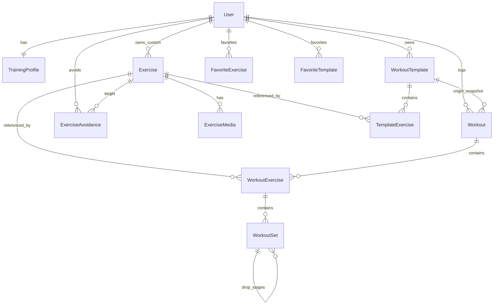

# GymTrack Pro — Domain Spec (Data Model)

> **How to use this file:** This is the agreed data model, written before any Prisma schema exists.  
> Decisions here are **already made** with Brunno; each one records why and what we rejected.  
> Change a decision here **before** changing code, so migrations stay intentional.

**Last updated:** August 2026  
**Product:** GymTrack Pro  
**Related:** [FEATURES.md](./FEATURES.md) · [TECH_STACK.md](./TECH_STACK.md) · [DESIGN_SPEC.md](./DESIGN_SPEC.md) · [LEARNING_CONSTITUTION.md](./LEARNING_CONSTITUTION.md)

---

## 1. Scope

The catalog starts empty and grows through curator-reviewed, AI-assisted entries (decisions 5.14 to 5.16). This spec covers the entities needed for MVP and v1 as listed in FEATURES sections 5.1 and 5.2:

- User accounts and physical profile (feeds the AI generator)
- Exercise catalog, custom exercises, execution media
- Templates (routines) and logged workouts
- Set logging including intensity techniques
- Favorites and the exercise avoid list

Out of scope here: offline sync, S3 media hosting, wearables (FEATURES 5.3 / 5.4).

---

## 2. Entity overview



Reading the core chain: a **WorkoutTemplate** is the plan you reuse; a **Workout** is one session you actually performed; **WorkoutSet** rows are the numbers you typed at the gym.

---

## 3. Entities and fields

### 3.1 User

Authentication is handled by Auth.js (TECH_STACK 2.8), so this table stays thin.

| Field | Type | Notes |
|-------|------|-------|
| `id` | string (cuid) | PK |
| `email` | string | unique |
| `name` | string? | from OAuth profile |
| `imageUrl` | string? | from OAuth profile |
| `role` | `UserRole` | `member` \| `curator` — only curators touch the global catalog, decision 5.16 |
| `createdAt` | datetime | |

### 3.2 TrainingProfile

Physical / training attributes that the AI generator needs. Separated from `User` because auth identity and body data change for different reasons and at different rates. Named `TrainingProfile` (not `UserProfile`) so it is not confused with login identity — decision 5.19.

| Field | Type | Notes |
|-------|------|-------|
| `userId` | string | PK + FK, one profile per user (1:1) |
| `gender` | `Gender` | `male` \| `female` — decision 5.5 |
| `birthDate` | date? | store birth date, not age — decision 5.6 |
| `bodyWeightKg` | decimal(5,2)? | current weight; history is `later` |
| `experienceLevel` | `ExperienceLevel` | `beginner` \| `intermediate` \| `advanced` |
| `preferredUnit` | `WeightUnit` | default unit in the logging UI; per-set override always allowed |
| `updatedAt` | datetime | |

`gender`, `birthDate`, `bodyWeightKg`, and `experienceLevel` are nullable at signup: the generator must work with partial data and fall back to neutral defaults. `preferredUnit` defaults to `kg`.

### 3.3 Exercise

Both the global catalog and personal custom moves live here.

| Field | Type | Notes |
|-------|------|-------|
| `id` | string | PK |
| `ownerId` | string? | `null` = global catalog; set = personal custom exercise — decision 5.16 |
| `name` | string | canonical English name |
| `namePtBr` | string? | Brazilian Portuguese name, for search — decision 5.15 |
| `searchAliases` | string[] | other spellings the user might type, both languages |
| `primaryMuscle` | `MuscleGroup` | coarse grouping, for browsing |
| `primaryEmphasis` | `MuscleEmphasis[]` | 1-3 precise targets of comparable importance; empty until reviewed — decision 5.17 |
| `secondaryEmphasis` | `MuscleEmphasis[]` | supporting targets — decision 5.17 |
| `emphasisRationale` | string? | short justification + references, for spot-checking — decision 5.18 |
| `equipment` | `Equipment` | |
| `trackingMode` | `TrackingMode` | which set columns apply — decision 5.8 |
| `formCues` | string? | short text: angle, grip, common mistakes |
| `dataSource` | `ExerciseDataSource` | `ai_assisted` \| `manual` — provenance |
| `wasGrounded` | boolean | whether reference data backed the AI proposal — decision 5.14 |
| `isVerified` | boolean | a curator reviewed the fields; gates the AI generator — decision 5.15 |
| `verifiedById` | string? | who approved it |
| `verifiedAt` | datetime? | |
| `isActive` | boolean | soft-hide from catalog without breaking history |
| `createdAt` | datetime | |

Indexes: `(ownerId)`, `(primaryMuscle)`, `(equipment)`, `(isVerified)`, plus a GIN index on `primaryEmphasis` and `secondaryEmphasis` for array containment queries — these are the browse/filter paths and the AI candidate query. Trigram index across `name`, `namePtBr`, and `searchAliases` for the dedupe lookup.

### 3.4 ExerciseMedia

Execution demos (YouTube, Instagram). Separate table so one exercise can hold several links and so dead links can be audited per provider.

| Field | Type | Notes |
|-------|------|-------|
| `id` | string | PK |
| `exerciseId` | string | FK |
| `provider` | `MediaProvider` | `youtube` \| `instagram` \| `other` — decision 5.4 |
| `url` | string | validated on write (see section 7) |
| `label` | string? | e.g. "front view", "common mistakes" |
| `addedById` | string? | who contributed it |
| `lastCheckedAt` | datetime? | for a future dead-link sweep |
| `isBroken` | boolean | default false |

### 3.5 WorkoutTemplate and TemplateExercise

| WorkoutTemplate | Type | Notes |
|-------|------|-------|
| `id` | string | PK |
| `userId` | string | FK, templates are private |
| `name` | string | e.g. "Push A" |
| `notes` | string? | |
| `source` | `TemplateSource` | `manual` \| `ai_generated` |
| `isArchived` | boolean | FEATURES line 106 wants archive + recover |
| `createdAt` | datetime | |

| TemplateExercise | Type | Notes |
|-------|------|-------|
| `id` | string | PK |
| `templateId` | string | FK |
| `exerciseId` | string | FK |
| `position` | int | display order within the template |
| `targetSets` | int? | plan, not result |
| `targetRepsMin` / `targetRepsMax` | int? | rep range, e.g. 8-12 |
| `targetTechnique` | `IntensityTechnique` | planned technique, default `standard` |
| `restSeconds` | int? | feeds the rest timer |

`position` is an explicit integer, not row insertion order — relational rows have no inherent order.

There is deliberately **no** `targetWeightKg` here — load comes from the user's last performance, see decision 5.11.

### 3.6 Workout and WorkoutExercise

| Workout | Type | Notes |
|-------|------|-------|
| `id` | string | PK |
| `userId` | string | FK |
| `templateId` | string? | provenance only; data is copied — decision 5.1 |
| `templateNameSnapshot` | string? | name at the time, survives template rename/delete |
| `startedAt` | datetime | |
| `finishedAt` | datetime? | `null` = session in progress |
| `notes` | string? | |

| WorkoutExercise | Type | Notes |
|-------|------|-------|
| `id` | string | PK |
| `workoutId` | string | FK |
| `exerciseId` | string | FK |
| `position` | int | |
| `restSeconds` | int? | copied from the template, editable in session |
| `swappedFromExerciseId` | string? | one-off swap audit — decision 5.3 |

Index: `(userId, startedAt desc)` on `Workout` — the history list and progress charts both read this way.

### 3.7 WorkoutSet

The core logging table, and the one with the self-relation for intensity techniques.

| Field | Type | Notes |
|-------|------|-------|
| `id` | string | PK |
| `workoutExerciseId` | string | FK |
| `parentSetId` | string? | `null` = a real set; set = a later stage of that set |
| `stageIndex` | int | 0 for the parent, 1..n for stages |
| `setNumber` | int? | only meaningful on parents; user-facing "set 1, 2, 3" |
| `technique` | `IntensityTechnique` | only meaningful on parents; default `standard` |
| `weightKg` | decimal(7,2)? | canonical total load in kg, **bar excluded** — decisions 5.9, 5.12, 5.13 |
| `enteredWeight` | decimal(6,2)? | exactly the number the user typed — decision 5.13 |
| `enteredUnit` | `WeightUnit` | `kg` \| `lb`, as shown on the plate or machine |
| `weightEntryMode` | `WeightEntryMode` | `total` \| `per_side` — decision 5.12 |
| `reps` | int? | |
| `durationSeconds` | int? | for `time` tracking modes |
| `distanceMeters` | decimal(8,2)? | for `distance` tracking modes |
| `rpe` | decimal(3,1)? | optional effort rating |
| `intraRestSeconds` | int? | rest taken *before* this stage; stages only — decision 5.10 |
| `isCompleted` | boolean | supports planned-but-skipped sets |
| `completedAt` | datetime? | |

Indexes: `(workoutExerciseId)`, `(parentSetId)`.

**Worked example** — a normal 50 kg x 8 set followed by a drop set (40x10, 30x6, 20x5):

| id | parentSetId | stageIndex | setNumber | technique | weightKg | reps |
|----|-------------|------------|-----------|-----------|----------|------|
| 1 | null | 0 | 1 | standard | 50 | 8 |
| 2 | null | 0 | 2 | drop_set | 40 | 10 |
| 3 | 2 | 1 | null | — | 30 | 6 |
| 4 | 2 | 2 | null | — | 20 | 5 |

Four rows, three of them with `parentSetId` filled. Counting sets means filtering `parentSetId IS NULL` (2 sets). Total volume is a plain aggregate over every row:

```sql
SELECT SUM(s."weightKg" * s.reps) AS volume_kg
FROM "WorkoutSet" s
JOIN "WorkoutExercise" we ON we.id = s."workoutExerciseId"
WHERE we."workoutId" = $1;
```

### 3.8 ExerciseAvoidance

The permanent avoid list. This is what makes the "swap this exercise" button durable rather than a one-off edit.

| Field | Type | Notes |
|-------|------|-------|
| `id` | string | PK |
| `userId` | string | FK |
| `exerciseId` | string | FK |
| `reason` | `AvoidanceReason` | `injury` \| `dislike` |
| `note` | string? | free text, e.g. "scoliosis - axial loading" |
| `createdAt` | datetime | |

Unique constraint on `(userId, exerciseId)`. The AI prompt reads this list as a hard exclusion for `injury` and a strong preference for `dislike`.

### 3.9 Favorites

Two thin join tables rather than one polymorphic table, so foreign keys stay enforceable.

| FavoriteExercise | `userId` + `exerciseId`, unique together |
|---|---|
| **FavoriteTemplate** | `userId` + `templateId`, unique together |

---

## 4. Enums

`Gender`: `male`, `female`

`ExperienceLevel`: `beginner`, `intermediate`, `advanced`

`Equipment`: `barbell`, `dumbbell`, `machine`, `cable`, `smith_machine`, `bodyweight`, `kettlebell`, `band`, `other`

`TrackingMode`: `reps_weight`, `reps_only`, `time`, `distance`, `time_distance`

`IntensityTechnique`: `standard`, `drop_set`, `rest_pause`, `cluster`, `myo_reps`

`MediaProvider`: `youtube`, `instagram`, `other`

`WeightEntryMode`: `total`, `per_side`

`WeightUnit`: `kg`, `lb`

`UserRole`: `member`, `curator`

`ExerciseDataSource`: `ai_assisted`, `manual` — `ai_assisted` rows additionally record whether grounding data was available

`AvoidanceReason`: `injury`, `dislike`

`TemplateSource`: `manual`, `ai_generated`

`MuscleGroup`: `chest`, `back`, `shoulders`, `biceps`, `triceps`, `forearms`, `quads`, `hamstrings`, `glutes`, `calves`, `abs`, `lower_back`, `neck`, `full_body`

`MuscleEmphasis` (starter list, extend as the catalog grows): `chest_upper`, `chest_mid`, `chest_lower`, `deltoid_anterior`, `deltoid_lateral`, `deltoid_posterior`, `lat`, `trap_upper`, `trap_mid`, `trap_lower`, `rhomboid`, `biceps_long_head`, `biceps_short_head`, `brachialis`, `triceps_long_head`, `triceps_lateral_head`, `quad_vastus_lateralis`, `quad_vastus_medialis`, `quad_rectus_femoris`, `hamstring_biceps_femoris`, `hamstring_medial`, `glute_max`, `glute_med`, `calf_gastrocnemius`, `calf_soleus`, `abs_upper`, `abs_lower`, `obliques`, `erector_spinae`

`drop_set`, `rest_pause`, `cluster`, and `myo_reps` all use the same parent-plus-stages shape (decision 5.2). What differs is the *pattern of values*, not the structure:

| Technique | Typical weight across stages | Typical `intraRestSeconds` |
|-----------|------------------------------|----------------------------|
| `drop_set` | decreases each stage | 0 |
| `rest_pause` | stays the same | 10-20 |
| `cluster` | stays the same | 15-30 |
| `myo_reps` | stays the same | 3-5 |

**Superset is deliberately absent** from `IntensityTechnique`. A superset links two *different* exercises, so it cannot be expressed by `parentSetId`, which links stages of one exercise. When FEATURES promotes it from `idea`, it needs its own `SupersetGroup` table.

---

## 5. Decision log

### 5.1 Starting a workout copies the template

**Chosen:** copy `TemplateExercise` rows into `WorkoutExercise` at session start; keep `templateId` for provenance only.

**Why:** history must be immutable. Editing "Push A" in March must not rewrite what you actually did in January. Same reasoning as an invoice storing the price at sale time instead of linking to the current price.

**Rejected:** referencing the template live. Cheaper on storage, but every template edit silently falsifies past sessions, and deleting a template would orphan history.

**Cost:** more rows, and template improvements do not retroactively apply — which is the point.

### 5.2 Intensity technique stages use a self-relation on WorkoutSet

**Chosen:** each stage is its own `WorkoutSet` row; stages point at the parent via `parentSetId`.

**Why:** weight and reps stay real numeric columns, so volume, PR detection, and charts are plain SQL aggregates that the database can index and optimize.

**Rejected — JSON column for the drop stages:** one row per set, but Postgres cannot validate the JSON contents, and `SUM(weightKg * reps)` would silently return only the first stage. A wrong-but-plausible number is worse than a loud failure.

**Rejected — separate `SetDrop` table:** an extra table and join for rows that hold exactly the same shape as the parent, and it would be misnamed once rest-pause and cluster reuse it.

**Cost / known trap:** counting sets requires `parentSetId IS NULL`. Forgetting that filter inflates set counts. Mitigation: all set queries go through domain functions covered by Vitest (TECH_STACK 4.1), never ad-hoc queries in components.

### 5.3 Swap reason decides scope: session-only vs permanent

**Chosen:** two distinct paths behind one button.

| User reason | Scope | Storage |
|-------------|-------|---------|
| Equipment busy, just today | this session | `WorkoutExercise.swappedFromExerciseId` |
| Injury (e.g. scoliosis) | permanent | `ExerciseAvoidance` with `reason = injury` |
| Dislikes the exercise | permanent, reversible | `ExerciseAvoidance` with `reason = dislike` |

**Why:** a scoliosis-driven swap that only affects one session is a bug — the next AI generation would suggest the same unsafe movement. Conversely, recording "machine was occupied" as a permanent exclusion would shrink the catalog for no reason.

**Replacement candidates** come from overlapping `primaryEmphasis` first, then `secondaryEmphasis`, then `primaryMuscle`, excluding anything in the avoid list.

### 5.4 Media lives in its own table with an explicit provider

**Chosen:** `ExerciseMedia` rows carrying `provider`, `url`, `isBroken`, `lastCheckedAt`.

**Why:** multiple demo angles per exercise; and Instagram links rot faster than YouTube (private accounts, deleted posts, embed restrictions). Storing the provider as an enum lets us later sweep and report dead links per platform without parsing URL strings.

**Rejected:** a single `mediaUrl` string on `Exercise`. One link only, no provenance, no way to audit.

### 5.5 Gender enum is `male | female`

**Chosen by Brunno:** two values, because the generator uses it as a physiological signal for volume and intensity defaults.

**Trade-off recorded:** users who do not fit either value have no option, and the field is nullable so the practical fallback is leaving it empty. If that becomes a problem, adding `prefer_not_to_say` is a low-risk enum addition — the generator already needs neutral defaults for the null case.

### 5.6 Store `birthDate`, not `age`

**Why:** age is derived data that goes stale silently — a stored `28` is wrong within a year and nothing in the system knows. Birth date is a fact; age is computed at read time.

### 5.7 Muscle targets as array columns

**Chosen:** Postgres arrays of enum values (`primaryEmphasis`, `secondaryEmphasis`), queried with array containment and a GIN index.

**Why:** the lists are short, bounded by an enum, and every query is either "read it whole" or "does it contain X". A join table would add a table and a join for no query we actually need.

**Note:** an earlier draft also carried a coarse `secondaryMuscles: MuscleGroup[]`. It was removed because it duplicates information derivable from `secondaryEmphasis` — two columns describing the same fact drift apart the moment one is updated alone. `primaryMuscle` stays because coarse browsing ("show me back exercises") is a real, distinct query.

**Revisit if:** we start ranking exercises by weighted contribution per muscle, which would need a per-row weight and therefore a real join table.

### 5.8 `trackingMode` drives which set columns are used

`weightKg`, `reps`, `durationSeconds`, `distanceMeters` are all nullable because a plank has no reps and a treadmill run has no weight. The database cannot express "exactly these columns for this mode", so validation belongs in the domain layer with tests. Section 6 lists the rules.

### 5.9 Canonical weight column is kilograms, typed as `decimal`

**Why one canonical unit:** the app must be able to `SUM` and compare weights across sets. Mixed units in one column is a classic silent corruption — 45 and 20 are not comparable if one is pounds and the other kilograms. Kilograms is the canonical column; see decision 5.13 for how pound entries are preserved.

**Why decimal, not float:** binary floating point cannot represent 2.5 exactly, so repeated `SUM` over thousands of sets accumulates drift. Weight is a measurement we add up and compare — it deserves exact decimal arithmetic.

### 5.10 Stages carry `intraRestSeconds`

**Confirmed by Brunno:** rest-pause and cluster use the same parent-plus-stages shape as drop set.

That confirmation exposed a missing field. In a drop set the defining variable is the *weight drop*, which the existing columns already capture. In rest-pause and cluster, the weight usually does not change — the defining variable is the **short rest between stages** (roughly 15-20s for rest-pause, 15-30s for cluster). Without a field for it, two structurally identical rows would be indistinguishable from a plain set repeated twice, and the log would lose the technique's actual parameter.

**Chosen:** `intraRestSeconds` on stage rows, meaning "rest taken before this stage". It stays null on parents, where `WorkoutExercise.restSeconds` already covers rest between sets.

**Rejected:** a single `intraRestSeconds` on the parent applied to all stages. Simpler, but cluster sets legitimately vary the rest between stages, and a per-stage timestamp would be the only way to recover it otherwise.

### 5.11 Load comes from last performance, not from the template

**Chosen by Brunno:** templates store no target weight. When a workout starts — including an AI-generated one — each exercise is pre-filled with the weight from the user's most recent logged set for that exercise, and the user adjusts up or down.

**Why:** the template stays a plan of movements, sets, and rep ranges, which are stable. Load is the part that changes weekly, so storing it in the template would go stale and show an old number as if it were the goal. Pre-filling from history means a brand-new AI program still opens with realistic weights on day one instead of empty fields.

**Rejected:** `TemplateExercise.targetWeightKg`. It duplicates a value that history already knows, and creates two sources of truth that drift apart.

**Derivation:** the suggestion is a query, not a stored column. For a given user and exercise, take the most recent `Workout` with `finishedAt IS NOT NULL` that contains that exercise, and read its top-weight completed parent set. This needs the index `(workoutExerciseId)` on `WorkoutSet` plus `(userId, startedAt desc)` on `Workout`, both already specified.

**Edge case:** an exercise with no history (first time ever, or a swapped-in substitute) has no suggestion. The field opens empty rather than guessing from a similar exercise.

### 5.12 Total load counts plates and dumbbells only — the bar is excluded

**Chosen by Brunno:** the bar's own weight is never counted. Only the plates loaded on it, or the dumbbell/machine weight, count toward `weightKg`.

So "40 per side" on a barbell is stored as **80 kg**, and 40 kg dumbbells in each hand are also **80 kg**. The per-side conversion collapses to a single rule: `total = entered x 2`.

**Why this is defensible:** progression tracking cares about *comparability over time*, not about matching physics. As long as the convention never changes, a chart that rises from 80 to 90 reflects real progress either way. It also matches how you actually read the gym: you count the plates you loaded.

**Trade-off, stated honestly:** absolute load is understated by the bar's weight, so the numbers are not directly comparable to a lifter who includes the bar, and a one-rep-max calculator built on this column later would read low. If that ever matters, the fix is a documented convention change plus a migration — not a silent reinterpretation of existing rows.

**Simplification gained:** dropping the bar removed the need for a `barWeightKg` snapshot and the "which bar did I use" question entirely.

**Rejected:** storing per-side raw and converting at read time. Every query would need the conversion, and any query that forgot it would return a plausible wrong number — the same failure mode as decision 5.2.

### 5.13 Both kg and lb are accepted; kg is canonical, the original entry is preserved

Mixed units are not an edge case for this user — they are the daily reality. Brunno trains in Canada, where gyms commonly mix both systems: the dumbbells at his gym are labelled in pounds while some machines display kilograms. Forcing a single unit would mean doing mental math between sets, which is exactly the friction the app exists to remove. Any user in the US, UK, or Canada will hit the same mix, so this is a first-class requirement rather than a nice-to-have.

**Chosen:** three columns work together.

| Column | Role |
|--------|------|
| `enteredWeight` + `enteredUnit` | the literal number and unit the user typed, e.g. `45` + `lb` |
| `weightKg` | that value converted to kilograms and doubled if per-side, used by every aggregate |

Conversion factor: `1 lb = 0.45359237 kg`, applied once at write time.

**Why store the entry as well as the conversion:** converting back for display is lossy. 45 lb is 20.4117 kg; rounding that to two decimals and converting back yields 44.99 lb, so the machine's own label would stop matching what the app shows. Keeping the typed value means the user always sees the number they read off the equipment, while the math runs on a single comparable column.

**Why not store only the entered value plus unit:** then every `SUM`, chart, and personal-record comparison would have to convert inline, and one forgotten conversion produces a wrong-but-plausible result.

**Trade-off:** `weightKg` is derived data stored alongside its source, so the two can drift if written separately. Mitigation: a single domain function owns set creation and updates, computing `weightKg` from the entry every time; a test asserts the invariant `weightKg == convert(enteredWeight, enteredUnit) * (perSide ? 2 : 1)`.

**Profile default:** `TrainingProfile.preferredUnit` sets the initial unit in the logging UI so the common case needs no toggling, with a per-set override for the odd machine.

### 5.14 Catalog starts empty; free-exercise-db is grounding reference, not seed data

**Chosen by Brunno:** the catalog ships with **zero** exercises. Every row is created through the curator's assisted-entry flow (decision 5.15) and therefore reviewed before it exists.

[free-exercise-db](https://github.com/yuhonas/free-exercise-db) is still used, but only as a **reference file vendored in the repository** — never imported into the database. When the curator types a name, the server looks it up in that JSON and injects the matching record (equipment, muscles, instructions) into the Gemini prompt so the model refines real data instead of answering from nothing. No match means no grounding, and the reviewer is warned to check more carefully.

**Why not import it:** 800 unverified rows would clutter search, sit permanently unreviewed, and collide with curator-created rows as duplicates. Nobody reviews 800 exercises; the ones that matter are the 20-30 in an actual training split.

**Reliability of the reference data — stated plainly:** free-exercise-db is schema-validated and public domain, but it is **not** a professionally reviewed source. It descends from `wrkout/exercises.json`, restructured by a developer for his own use, with no certification, no expert review, and no anatomical citations. Its muscle labels are coarse (`biceps`, `shoulders`), never at our `deltoid_lateral` granularity.

It is treated accordingly: a **hint** that reduces fabrication, not an authority. That is the whole reason the design tolerates it — nothing from the file reaches the database without human approval, so the accuracy required of it is low. No free dataset would survive being treated as authoritative, so no design should depend on one.

**Cost:** roughly 2 MB of static JSON in the repository. No table, no migration, no unverified rows.

**Licensing, checked in August 2026:**

| Source | License | Verdict |
|--------|---------|---------|
| free-exercise-db | Unlicense (public domain) | Chosen |
| wger | AGPL-3.0 | Rejected |
| exercisedb.dev | AGPL-3.0 | Rejected |
| ExerciseDB via RapidAPI | Non-commercial on the free tier | Rejected |

AGPL is copyleft with a network-use trigger: running a derived service can oblige us to publish our source under the same license. That is a permanent commitment, so it is not something to discover after launch. The Unlicense carries no obligation at all.

**Why no images:** free-exercise-db's photos trace back to an older repository that never explicitly licensed them, so their chain of title is unclear. We do not need them — execution media comes from curated YouTube and Instagram links (decision 5.4), which sidesteps the risk entirely.

**Why a local file rather than a live API at runtime:** filters and the AI candidate query need array containment on `primaryEmphasis` in our own Postgres, and an external API cannot serve a field that only we define. A vendored file also has no latency, no rate limit, and no availability risk mid-workout.

**Consequence for the AI generator:** because every catalog row is reviewed on creation, `isVerified` is true for practically all rows from the start. The flag stays in the model as the enforced boundary — the generator queries `isVerified = true` exclusively — so that any future bulk import can never bypass review.

**Startup friction, accepted:** an empty catalog means an exercise must be added before it can be logged. Mitigation is a single sitting before first real use, adding the 20-30 exercises of the current split with AI assistance.

### 5.15 AI-assisted exercise entry, with a human approval gate

**Chosen by Brunno:** the curator types an exercise name in English or Brazilian Portuguese; Gemini proposes the structured fields; the curator reviews and approves; then the curator attaches the execution link.

**Grounding:** when the typed name matches a record in the vendored free-exercise-db file (decision 5.14), that record's data (equipment, muscles, instructions) goes into the prompt and Gemini is asked to *refine* it — chiefly to derive the emphasis arrays and the Portuguese name. Grounding the model on concrete data instead of letting it answer from nothing is the main defence against confident fabrication. When there is no match, the response carries no grounding and the review UI says so.

**Non-negotiable gate:** the model **proposes**, a human **approves**. Nothing is written to the catalog straight from a model response. `isVerified` flips to true only on human approval, and the AI workout generator queries `isVerified = true` exclusively.

**Why the gate matters more here than elsewhere:** a wrong emphasis does not sit idle. It feeds workout generation, so one bad field silently produces bad training programs months later, with no trace back to its origin.

**Deduplication, before any model call:** search `name`, `namePtBr`, and `searchAliases` for the typed text and show matches. "Supino reto", "bench press", and "barbell bench press" must resolve to one row. Three rows for one movement would fragment load history, break the last-weight suggestion (decision 5.11), and split progress charts.

**Model output is untrusted input:** every proposed enum value is validated against our enums before persistence. A response of `deltoid_side` is rejected and surfaced for correction, never coerced and never stored as free text — accepting arbitrary strings in the emphasis arrays would quietly break every filter that depends on them.

**Cost:** one Gemini call per new exercise, server-side only per TECH_STACK 2.10. Volume is a handful of calls per week, comfortably inside the free tier.

### 5.16 AI-created exercises are global; a curator role guards the catalog

**Chosen by Brunno:** exercises created through the assisted flow are global (`ownerId = null`), visible to every user, because family members will not populate the catalog themselves.

**The gap that creates:** if any user could write to the global catalog, one family member's mistake would corrupt the catalog for everyone, with nobody reviewing.

**Resolution:** `User.role`. Only a `curator` can create or verify global exercises. `member` accounts can still create personal custom exercises (`ownerId` set), which stay private and never reach the shared catalog.

**Rejected:** personal-first with later promotion to global. Safer in theory, but it adds a promotion step that only Brunno would ever perform, delaying the exact benefit the family is supposed to get.

**Trade-off:** the catalog's quality rests on one person. Mitigation is `dataSource` plus `verifiedById`, so any questionable row can be traced to how it was created and who approved it.

### 5.17 Emphasis is a list, not a single value

**Confirmed by Brunno:** for many movements he cannot name one dominant emphasis, and forcing a single value would mean choosing arbitrarily.

He is right, and the anatomy backs it: a bent-over row loads `trap_mid`, `rhomboid`, and `lat` at comparable levels with no clear winner. A single-value column would force a fake decision, and the AI generator would then treat that arbitrary pick as fact.

**Chosen:** `primaryEmphasis` holds 1-3 targets of comparable importance; `secondaryEmphasis` holds supporting ones.

**Why not a single primary plus a list of secondaries:** that is the same forced choice wearing a different hat. If three muscles are genuinely co-primary, the data should say so.

**Why not numeric weights (e.g. lat 40%, trap 35%):** the precision would be invented. Nobody, including a certified trainer, can defend "40" over "35" for a given exercise, and stored numbers acquire unearned authority. A short unordered list is honest about what is actually known.

**Query impact:** "focus rear delts" becomes `primaryEmphasis @> ARRAY['deltoid_posterior']`, which finds exercises where it is a main target, not those where it is incidental. The `secondaryEmphasis` array serves the smart-swap feature, where a near match is acceptable.

**Cap at three:** more than three co-primary targets usually means the exercise is compound enough that `primaryMuscle` is the useful signal. Enforced in validation, not by the database.

### 5.18 The human gate stays, but it checks plausibility, not anatomy

Brunno's concern is legitimate: he is not a trained professional, and asking him to certify anatomical claims would be theatre. But removing the gate entirely is not the answer either, because the failure it prevents is real.

**What the model actually does:** Gemini predicts plausible text; it does not perform research. It is usually right on well-documented movements like a bench press, and least reliable exactly on the ambiguous exercises where its help is most wanted — and it cannot signal which case it is in. Its confident tone is identical either way.

**Chosen:** redefine `isVerified` to mean *a curator reviewed this row and found it plausible, non-duplicated, and internally consistent* — not *anatomically certified*. Concretely, the curator checks that the exercise is not already in the catalog under another name, that the equipment and tracking mode match reality, that the muscles named are anatomically possible for the movement, and that the Portuguese name is correct. All four are within reach of an informed non-specialist.

**Support for the reviewer:** the model must return `emphasisRationale` — a short justification naming the mechanics involved and pointing at recognised references. That makes the claim checkable instead of oracular, and it doubles as study material, which serves the project's learning goal.

**The one place this is not enough:** injury and contraindication data. A wrong emphasis produces a suboptimal workout, which is recoverable. A wrong "safe with scoliosis" claim can hurt someone. Therefore the model never writes to `ExerciseAvoidance` and never asserts medical suitability; that list is filled only by the user's own decisions, per decision 5.3.

**Rejected:** letting unverified AI output feed workout generation directly. It removes the only checkpoint between a fabricated field and a training program, and the error would surface months later with no trace to its origin.

### 5.19 Profile table is named `TrainingProfile`, not `UserProfile`

**Chosen by Brunno:** keep two tables (`User` + profile), but name the second `TrainingProfile`.

**Why two tables:** Auth.js owns login identity; body/training attributes change for different reasons. Mixing them in one table makes the auth adapter and the gym form fight over the same row.

**Why not `UserProfile`:** the names are too similar and invite confusion between “who is logged in” and “what the AI needs for programming”.

**Rejected — one table:** simpler for MVP, but conflates auth identity with training data ahead of Phase 3.

---

## 6. Validation rules (domain layer, Vitest-covered)

1. A set with `parentSetId != null` must not carry `technique` or `setNumber`; those belong to the parent. Conversely, `intraRestSeconds` is only valid on stages.
2. A stage's `parentSetId` must point to a set with `parentSetId IS NULL` — one level deep only, no chains.
3. A stage must belong to the same `workoutExerciseId` as its parent.
4. `stageIndex` is unique per parent and contiguous from 1.
5. `technique = standard` must have zero stages; the other techniques should have at least one.
6. Required columns per `trackingMode`: `reps_weight` needs `weightKg` and `reps`; `reps_only` needs `reps`; `time` needs `durationSeconds`; `distance` needs `distanceMeters`; `time_distance` needs both.
7. `weightKg >= 0`, `reps >= 1`, `rpe` between 1 and 10.
8. `weightKg` must always equal `convert(enteredWeight, enteredUnit)` multiplied by 2 when `weightEntryMode = per_side`. Conversion happens once, at write time, in one domain function — never inline in a query or component.
9. The bar is never included in `weightKg` (decision 5.12).
10. A `Workout` cannot have `finishedAt` before `startedAt`.
11. Only one unfinished `Workout` per user at a time.
12. A custom `Exercise` may only be referenced by its owner.
13. Only a `curator` may create or modify an `Exercise` with `ownerId = null`, or set `isVerified`.
14. `isVerified = true` requires a non-empty `primaryEmphasis`, plus `primaryMuscle`, `equipment`, `trackingMode`, `verifiedById`, and `verifiedAt`.
14a. `primaryEmphasis` holds between 1 and 3 values; no value may appear in both `primaryEmphasis` and `secondaryEmphasis`.
14b. The AI may propose `emphasisRationale` but never writes `ExerciseAvoidance`, and never asserts medical suitability (decision 5.18).
15. Every enum field proposed by the AI is validated against its enum before persistence; invalid values are rejected, never coerced.
16. A new exercise name is checked against `name`, `namePtBr`, and `searchAliases` before creation, to prevent duplicates of the same movement.

---

## 7. Known edge cases and bugs to guard

| Risk | Guard |
|------|-------|
| Set count inflated by drop stages | Every count filters `parentSetId IS NULL`; covered by a Vitest case with a drop set present |
| Volume double-counted if stages summed twice | Volume sums all rows once; never sum parent then add stages |
| Deleting a parent set orphans stages | Cascade delete stages with the parent |
| Deleting an exercise breaks history | Soft-delete via `isActive`; block hard delete when referenced by a `WorkoutExercise` |
| Template deleted after sessions exist | `Workout.templateId` nullable + `templateNameSnapshot` preserves the label |
| Renaming a template changes past labels | Snapshot field, per decision 5.1 |
| Bodyweight changes invalidate old bodyweight-exercise volume | Accepted for MVP; a `BodyWeightLog` table is the `later` fix |
| Unfinished workout abandoned for days | Rule 11 above blocks a second one; UI offers resume or discard |
| Enum extension breaks existing rows | Enum additions are additive-only; never rename a value in place |
| Per-side weight stored raw, halving all volume | Conversion happens once at write; `weightKg` is total by definition, asserted in tests |
| Last-weight suggestion pulls from an unfinished session | Suggestion query filters `finishedAt IS NOT NULL` and `isCompleted = true` |
| Pound entry summed as if it were kilograms | Aggregates read `weightKg` only; `enteredWeight` is display-only and never summed |
| Lossy round-trip showing 44.99 lb instead of 45 lb | Original entry preserved in `enteredWeight`, never recomputed from `weightKg` |
| `weightKg` drifting out of sync with its entry | One domain function owns set writes; invariant asserted in tests (rule 8) |
| Suggested load shown in the wrong unit | Suggestion carries the stored `enteredUnit` of the source set, converted to the user's preferred unit for display |
| Duplicate rows for one movement across languages | Dedupe search over `name`, `namePtBr`, `searchAliases` before creating; trigram index makes it fast |
| Load history fragmented by a duplicate exercise | Consequence of the above; merging duplicates later needs a migration, so prevention is the guard |
| AI-invented emphasis reaching generated workouts | Generator filters `isVerified = true`; verification is human-only |
| Reviewer rubber-stamping claims he cannot judge | Gate is scoped to plausibility, duplicates, equipment, and naming; `emphasisRationale` makes claims checkable (decision 5.18) |
| Forced single emphasis distorting the generator | `primaryEmphasis` is a list of co-primary targets (decision 5.17) |
| AI asserting an exercise is safe for a condition | Model never writes `ExerciseAvoidance` and never claims medical suitability |
| AI enum value silently stored as free text | Rule 15 rejects unknown values; emphasis stays a real enum array |
| Family member corrupts the shared catalog | Rule 13: only `curator` writes global rows |
| Reference dataset mistaken for an authoritative source | Documented as a hint only (decision 5.14); nothing from it reaches the database unreviewed |
| Ungrounded AI proposal accepted as readily as a grounded one | `wasGrounded` is stored and shown in the review UI, which flags the ungrounded case |
| Empty catalog blocking the first workout | Curator pre-loads the current split in one sitting before first real use |

---

## 8. Security and privacy

**Health data.** `ExerciseAvoidance.reason = injury` and its note describe medical conditions (your scoliosis example). Combined with `gender`, `birthDate`, and `bodyWeightKg`, this is sensitive personal data, not ordinary app state. Consequences:

- Never expose it in a shared/public payload; there is no social feed, so there is no legitimate cross-user read path.
- Keep it out of logs and out of error messages.
- When building the AI prompt, send only what the generation needs and never store the raw prompt with identifiers alongside the model response.

**Authorization.** Every query for `Workout`, `WorkoutTemplate`, `TrainingProfile`, favorites, and avoidances must be scoped by the session `userId` on the server. A custom `Exercise` (`ownerId != null`) is readable only by its owner. Row ownership is checked server-side, never inferred from a client-supplied id.

**Media URLs.** `ExerciseMedia.url` is user-supplied and later rendered as a link. Validate on write: allow only `https:` scheme and hostnames matching the declared provider; reject `javascript:` and `data:` URIs to prevent XSS through a crafted href. Render external links with `rel="noopener noreferrer"`.

**Input validation.** All writes are validated server-side against the section 6 rules; client-side validation is convenience only. Prisma parameterizes queries, which covers SQL injection for normal use — any future raw SQL must use parameter binding, never string concatenation.

**LLM output is untrusted input.** The Gemini response in the assisted-entry flow is treated exactly like a form submission from a stranger: parsed against a strict schema, enums checked against our enum values, string lengths bounded, and anything unexpected rejected rather than coerced. A model response is never interpolated into SQL and never persisted unreviewed.

**Prompt injection surface.** The exercise name is user-supplied text that reaches a model prompt. Bound its length and character set, and treat the model's reply as data only — it must never be able to trigger an action, only propose field values that a human then approves.

**Curator authorization.** The `curator` check for global catalog writes happens server-side against the session user's role. Role is never read from the request body or a client-side flag.

**Hiding UI is not authorization.** The "add exercise" button is rendered only for curators, which is a usability measure. Anyone can read the client bundle, find the route, and call it directly, so the server-side role check is the actual control. Both exist; only the server check is security.

---

## 9. MVP acceptance criteria

The data model is done for MVP when all of these are possible:

1. A user signs in and fills gender, birth date, body weight, and experience level.
2. The catalog is browsable and filterable by emphasis and `equipment`, and searchable by Portuguese or English name.
2a. The "add exercise" action is visible only to a `curator`, and the server rejects it for a `member` even when called directly.
3. A `member` creates a custom exercise that only they can see; a `curator` creates a global one.
3a. Typing an existing movement's name in either language surfaces the existing row instead of offering to create a duplicate.
3b. The assisted flow proposes fields for a new exercise, the curator edits and approves, and only then is it `isVerified` and eligible for AI generation.
4. An exercise shows its form cues and one or more execution links.
5. A user builds a template with ordered exercises, target sets, and rep ranges.
6. Starting a workout from that template copies the exercises into the session.
7. A set is logged with weight and reps; a drop set is logged as parent plus stages.
8. Set count and total volume are both correct for a workout containing a drop set.
8a. Starting an exercise pre-fills the weight from the last completed session, and per-side entry stores the correct total.
8b. A set entered as 45 lb and a set entered as 20 kg both contribute correctly to the same volume total, and each still displays in the unit it was typed in.
9. The history list shows past workouts newest-first with their snapshot names.
10. Swapping an exercise for an injury reason persists into `ExerciseAvoidance`.

---

## 10. Open questions

- [x] Rest-pause and cluster follow the same `parentSetId` pattern as drop set — confirmed, see decision 5.10
- [x] No `targetWeightKg`; load is pre-filled from the last logged session — confirmed, see decision 5.11
- [x] Bar weight is not counted at all — confirmed, see decision 5.12
- [x] Both kg and lb are accepted per set — confirmed, see decision 5.13
- [x] Catalog starts empty; free-exercise-db is grounding reference only — confirmed, see decision 5.14
- [x] New exercises are created globally by a curator with AI assistance — confirmed, see decisions 5.15 and 5.16
- [x] Emphasis accepts multiple co-primary values — confirmed, see decision 5.17
- [ ] Which exercises the curator adds in the initial sitting (the current training split, roughly 20-30). No decision needed until the add-exercise screen exists.
