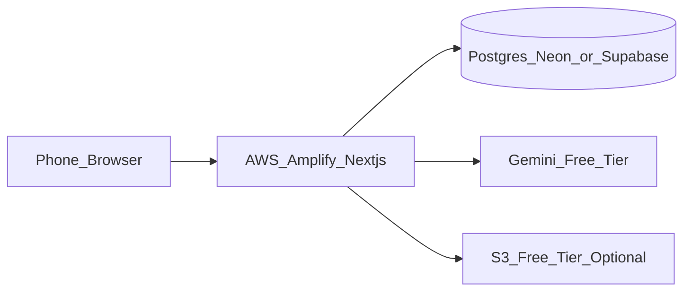

# GymTrack Pro — Tech Stack

> **How to use this file:** Challenge any choice before we code.  
> Each decision answers: **what / why / why not alternatives / cost**.

**Last updated:** August 2026  
**Product:** GymTrack Pro  
**Constraints:** Mobile-first web · Multi-user (you + family) · **~$0 cost** · Deploy on **AWS** · Learning-first (explainable in interviews)

**Related:** [FEATURES.md](./FEATURES.md)

---

## 1. Architecture (v1)

```text
Phone browser (mobile-first)
        │
        ▼
AWS Amplify Hosting  ──►  Next.js (App Router) + API routes
        │
        ├──► PostgreSQL (Neon or Supabase free)
        ├──► Gemini API (free tier, post-MVP AI)
        └──► S3 (optional, free tier, later media)
```



---

## 2. Decision log

### 2.1 Language — TypeScript (not plain JavaScript)

| | |
|--|--|
| **Chosen** | TypeScript |
| **Why** | Catch many bugs at compile time; better editor help; expected in interviews; safer as the domain grows (sets, emphasis, AI payloads) |
| **Why not JavaScript** | Faster to start, but refactors and “what shape is this object?” become painful; easier to ship subtle bugs |
| **Cost** | $0 (toolchain is free) |

---

### 2.2 UI library — React

| | |
|--|--|
| **Chosen** | React — **installed: 19.2.8** |
| **Why** | Huge job market; matches learning resources (React docs); pairs with Next.js and shadcn |
| **Why not Vue / Svelte** | Not worse — smaller hiring signal for many local markets; you’d learn two ecosystems if you jump later |
| **Cost** | $0 |

---

### 2.3 Framework — Next.js (App Router)

| | |
|--|--|
| **Chosen** | Next.js (App Router) — **installed: 16.3.3** |
| **Why** | UI + API in one project; file-based routing; good Amplify support; common in portfolios |
| **Why not Vite SPA + separate Express** | Teaches “pure” backend more clearly, but doubles deploy/config and slows MVP |
| **Why not Remix / Nuxt** | Fine tools; React+Next is the safer default for your learning + hiring goals |
| **Cost** | $0 (framework) |

**Version note (important).** Next.js 16 changed enough that guidance written for versions 13-15 is often wrong. Two consequences for how we work:

1. The package ships its full documentation to `node_modules/next/dist/docs/`, which is authoritative **for the exact installed version**. That is the first source to check, ahead of any blog post or model recollection.
2. `next dev` generates and maintains `AGENTS.md` at the repository root, pointing agents at those docs. It is committed on purpose — removing it only causes it to be recreated as an uncommitted change. `CLAUDE.md` is a one-line pointer to the same file.

Known renames and additions to watch for as we build: `middleware` is now `proxy`, caching moved to explicit `use cache` / `cacheComponents`, and typed routes are available via `typedRoutes`. Each will be verified against the local docs before use rather than assumed.

---

### 2.3.1 Animation — Motion (framer-motion successor)

| | |
|--|--|
| **Chosen** | **Motion** for React |
| **Why** | Interruptible springs instead of fixed timelines, which matters when a user taps faster than an animation finishes; small enough for the budgeted approach in [DESIGN_SPEC 2.4](./DESIGN_SPEC.md) |
| **Why not CSS transitions only** | Fine for the fast tiers, but the signature moments need orchestration and interruption that CSS alone handles poorly |
| **Why not GSAP** | More powerful and heavier than a four-moment motion budget justifies |
| **Cost** | $0 |

---

### 2.4 Styling & components — Tailwind CSS + shadcn/ui

| | |
|--|--|
| **Chosen** | Tailwind CSS (**installed: v4**) + **shadcn/ui** |
| **Why** | Mobile-first utilities; shadcn **copies components into your repo** so you own and can explain the code (good for learning) |
| **Why not only hand-written CSS** | Too slow for a polished responsive gym UI |
| **Why not Material UI (MUI)** | Heavier, more “black box”, generic look; harder to customize without fighting the library |
| **Why not Chakra / Mantine** | Also fine; shadcn + Tailwind is the current common Next.js path and keeps CSS skills visible |
| **Cost** | $0 |

**Version note.** Tailwind v4 configures itself in **CSS**, not JavaScript — there is no `tailwind.config.js`, and the scaffold did not create one. Design tokens are declared with `@theme` inside the global stylesheet. This is where the colour palette, spacing scale, and tabular-numeral typography from [DESIGN_SPEC 2.1-2.3](./DESIGN_SPEC.md) will live, so most tutorials showing a JS config object do not apply.

---

### 2.5 Charts — Recharts

| | |
|--|--|
| **Chosen** | Recharts |
| **Why** | React-friendly; enough for volume/load/PR charts; free |
| **Why not Chart.js alone** | Needs more React glue; Recharts is more idiomatic in React apps |
| **Why not D3 from scratch** | Maximum control, maximum time — overkill for v1 |
| **Cost** | $0 |

---

### 2.6 Database — PostgreSQL

| | |
|--|--|
| **Chosen** | PostgreSQL |
| **Why** | Data is relational: User → Template → Workout → Sets; strong SQL story for interviews |
| **Why not MongoDB** | Document DB fits less naturally; you’d reinvent relations and integrity |
| **Why not SQLite only** | Great for local demos; weaker for multi-user cloud on Amplify without extra work |
| **Cost** | $0 on Neon/Supabase free tier (see hosting) |

---

### 2.7 ORM — Prisma

| | |
|--|--|
| **Chosen** | Prisma — **installed: 7.10.0** (pinned; npm `latest` pointed at an 8.x RC) |
| **Why** | Clear schema file; migrations; good TS types; fast to learn for CRUD |
| **Why not raw SQL only** | Best learning for SQL depth, but slows features and increases boilerplate errors early |
| **Why not Drizzle** | Excellent and lighter; Prisma wins here for docs/community for beginners — revisit later if you prefer |
| **Runtime note (v7)** | `PrismaClient` requires a driver adapter (`@prisma/adapter-pg` + pooled `DATABASE_URL`). The CLI uses `DATABASE_URL_UNPOOLED` via `prisma7.config.ts` for migrations |
| **Cost** | $0 |

---

### 2.8 Auth — Auth.js (NextAuth)

| | |
|--|--|
| **Chosen** | Auth.js (NextAuth) + free provider (e.g. Google OAuth and/or credentials) |
| **Why** | Open source; works with Next.js; enough for family accounts without building crypto/session security from zero |
| **Why not “auth from scratch”** | High chance of security mistakes; bad trade for a learning portfolio unless the goal is security engineering |
| **Why not Clerk / Auth0** | Nice DX; free tiers have limits and feel more “I plugged a SaaS” than “I understand sessions/OAuth” |
| **Why not Amazon Cognito (yet)** | More “AWS pure”, but heavier DX; good **later** upgrade if you want a stronger AWS auth story |
| **Cost** | $0 (Auth.js + Google OAuth free tier for low traffic) |

---

### 2.9 Timers & sound — Web platform APIs

| | |
|--|--|
| **Chosen** | Native browser APIs (`setInterval` / `requestAnimationFrame`, **`AudioContext` with synthesised cues**); optional **Wake Lock API** later |
| **Why** | No extra dependency for MVP; you learn how the browser really works |
| **Why synthesised, not audio files** | Distinctive sound identity with zero bytes downloaded, no licensing, and no network at the moment the timer hits zero. Full palette in [DESIGN_SPEC 2.5](./DESIGN_SPEC.md) |
| **Gotcha** | Mobile browsers block audio until a user gesture — the context must be resumed on the "start workout" tap, or the timer ends in silence |
| **Why not a heavy timer library** | Unnecessary until native approach proves painful |
| **Limits** | Mobile browsers throttle timers/audio when the tab is backgrounded or the phone is locked. Design for **workout screen active**; don’t promise native-app background behavior |
| **Cost** | $0 |

---

### 2.10 AI (post-MVP) — Gemini API

| | |
|--|--|
| **Chosen** | Google Gemini API (free tier) behind a Next.js server route |
| **Why** | Free quota for experimentation; server-side key keeps secrets off the client; prompt can include muscle-emphasis catalog |
| **Why not calling the LLM from the browser with an exposed key** | Insecure |
| **Why not OpenAI only** | Also fine; Gemini free tier fits the $0 goal — switch if you prefer |
| **Cost** | $0 within free quota; monitor usage |

---

### 2.11 Media storage

| | |
|--|--|
| **MVP** | Text cues + external links (YouTube, etc.) |
| **Later** | AWS S3 free tier for owned GIFs/videos |
| **Why this order** | Hosting hundreds of media files on day one adds cost/complexity without proving the product |
| **Cost** | $0 at MVP; S3 free tier has limits — stay small |

---

### 2.12 Hosting — AWS Amplify (not Vercel)

| | |
|--|--|
| **Chosen** | **AWS Amplify Hosting** for the Next.js app |
| **Why** | Meets your goal: show you can deploy on Amazon; free tier friendly for small apps |
| **Why not Vercel** | Best DX for Next.js, but weaker “I use AWS” story for your target |
| **Why not EC2 on day one** | Free tier exists, but you own Nginx, SSL, process restarts, scaling — great **later** learning, slow for MVP |
| **Cost** | Aim $0; enable **billing alerts**; stay inside free tier |

---

### 2.13 Database hosting — Neon (decided)

| | |
|--|--|
| **Chosen by Brunno** | **Neon** free PostgreSQL |
| **Why** | Free tier is ongoing rather than time-limited; the project is never paused for inactivity; **database branching** lets us rehearse a destructive migration on an isolated copy before touching real data |
| **Why not Supabase** | Familiar (already used on another project), but free projects are **paused after about a week of inactivity** — bad for a portfolio link a recruiter may open weeks later. Half its value is the bundled auth, which is redundant since we chose Auth.js |
| **Why not Prisma Postgres** | Provisions in one command, but newer and less recognised by employers than Neon |
| **Why not local Postgres in Docker** | No quotas, but requires Docker and does not serve the deployed app, so we would maintain two databases |
| **Why not RDS free tier as default** | 12-month free tier then easy surprise bills if forgotten |
| **Portfolio framing** | “App on AWS Amplify; managed Postgres on Neon for $0. Can migrate to RDS later.” |
| **Cost** | $0 on free plan |

---

### 2.14 PWA (light)

| | |
|--|--|
| **Chosen** | Web app manifest + icons (“Add to Home Screen”) |
| **Why** | Faster open at the gym |
| **Why not full offline service worker now** | Offline sync is a separate hard feature (see FEATURES) |
| **Cost** | $0 |

---

### 2.15 What we are not using (on purpose)

| Avoid early | Reason |
|-------------|--------|
| React Native / Expo | Doubles platform work; web MVP first |
| Microservices | Overkill for one small app |
| Paid CDN / paid auth / paid AI beyond free quotas | Breaks $0 goal |
| Unnecessary utility packs (`lodash`, `moment`, …) | Prefer native JS/TS unless justified |

---

## 3. Budget = ~$0

| Service | Plan | Risk |
|---------|------|------|
| Amplify Hosting | Free tier | Watch build minutes / overages |
| Neon or Supabase | Free | Fair-use limits |
| Auth.js + Google OAuth | Free | Low traffic OK |
| Gemini | Free tier | Cap usage; server-side only |
| S3 | Free tier later | Don’t store huge video libraries |
| GitHub + Actions | Free | Fine for private/public hobby CI |
| Custom domain | **Skip** | Domains cost money |

**Rules:**

1. Turn on AWS **billing alerts** on day one.  
2. Don’t leave RDS/EC2 “experiments” running.  
3. Prefer free-forever DB (Neon/Supabase) over expiring free tiers when possible.

---

## 4. Testing strategy (before commit / push)

Goal: **know it works before GitHub sees it.**

### 4.1 Layers

| Layer | Tool | What we test | When |
|-------|------|--------------|------|
| Unit / small integration | **Vitest** | Domain logic: set validation, volume, PRs, muscle-emphasis helpers, AI prompt builders | As soon as logic exists |
| End-to-end | **Playwright** | Critical UI flows: login, start workout, log set, timers | When UI flows stabilize |
| Static checks | ESLint (+ TypeScript) | Style / obvious mistakes | Always |

### 4.2 Why these tools

| Decision | Why | Why not |
|----------|-----|---------|
| **Vitest** | Fast; Jest-like API; fits modern TS/Next tooling | Jest — still fine, slightly heavier default today |
| **Playwright** | Solid mobile viewport testing; modern; free | Cypress — also fine; Playwright is enough |
| Manual only | — | Doesn’t scale; regressions sneak in |

### 4.3 Pre-commit / pre-push checklist

Run locally **before** `git commit` / `git push`:

```bash
npm run lint
npm test          # Vitest
# when UI changed:
npm run test:e2e  # Playwright (or a tagged smoke suite)
```

Only then commit and push.

### 4.4 Later

- **GitHub Actions** (free): run lint + Vitest on every push/PR.  
- **Husky** pre-commit hooks: optional after the checklist is a habit (don’t fight the tool on day one).

### 4.5 What “good enough” means for interviews

You should be able to say:  
“I test domain logic with Vitest, critical flows with Playwright, and I don’t push until lint/tests pass.”

---

## 5. Suggested learning order

1. TypeScript + React basics  
2. Tailwind + shadcn (build a couple screens)  
3. Next.js routes + server/client components  
4. Prisma schema + PostgreSQL queries  
5. Auth.js  
6. Workout logging UI + timers/sound  
7. **Vitest** on domain functions  
8. Charts (Recharts)  
9. Playwright smoke tests  
10. Amplify deploy  
11. AI program generation (Gemini) + prompt with muscle emphasis  
12. Optional: S3 media, Wake Lock, Cognito, EC2 deep-dive, offline sync  

---

## 6. Alignment with the Learning Constitution

- Prefer **few** dependencies; justify each.  
- Every stack choice above should be something you can **defend in an interview**.  
- If a feature needs a concept you don’t know yet — study or simplify before copying a complex setup.

---

## 7. Open questions for Brunno

Edit answers here when you decide:

- [x] Neon **or** Supabase for Postgres? → **Neon** (see 2.13: does not pause on inactivity; database branching)  
- [ ] Google OAuth only, or also email/password?  
- [ ] Confirm intensity techniques for MVP (drop set / rest-pause / …)  
- [ ] Any must-have muscle-emphasis list beyond shoulders example?  

---

**Next step after you review both docs:** adjust FEATURES/TECH_STACK, then scaffold the Next.js app under the constitution (explain → decide → small steps → tests).
